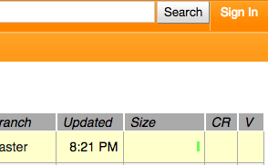
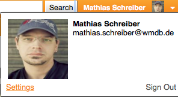
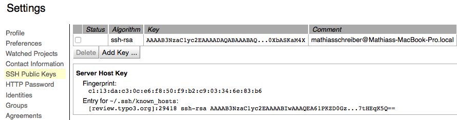

.. include:: ../Includes.txt

.. _TYPO3-Tutorial-ContributionWorkflow-GerritAccount:

Setting up your Gerrit account
------------------------------

Head over to Gerrit_ and click the **Sign In** button in the top right corner.

You will be prompted a regular **Basic Authentication** window, simply enter your TYPO3.org username and password you
had :ref:`set up earlier <TYPO3Account>`.

.. note::

   Once you are logged into Gerrit_, you can start to make yourself familiar with the interface. Don't worry if it looks
   intimidating at first, you'll be a **Pro** with it in no time.

Adding your SSH key
~~~~~~~~~~~~~~~~~~~

All communication with Gerrit_ works via SSH, so you will need to set up your public key to work.
Click on your profile in the top right corner and click **Settings**.

On the left hand side, click **SSH Public Keys** to set up your key.

.. note::

   If you work with different computers, for example with a notebook at work and another computer at home you will need
   so set up a key per computer. Luckily Gerrit_ can handle multiple keys.

.. important::

   Keep your keys private. Never give them away. No member of the TYPO3 project will ever ask you for your keys.

Click **Add Key** to add your new key and paste your key into the textbox below.

If you don't know how to create your SSH Public Key, we have compiled a list of links for you:

* :ref:`Apple OSX <ssh-key-osx>`
* :ref:`Microsoft Windows <ssh-key-win>`
* :ref:`Linux/Unix <ssh-key-unix>`