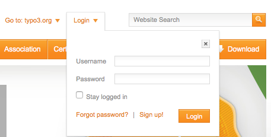
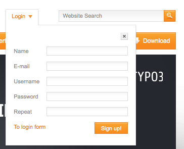

.. include:: ../Includes.txt

.. _TYPO3Account:

Adding an TYPO3.org account
---------------------------

Head over to TYPO3.org and locate the menu item called **Login**.

Once you click it, you will see the login form.

At the bottom you will find a link called **Sign Up**.

Upon clicking it, you will se a small form to fill in.

The fields in detail
~~~~~~~~~~~~~~~~~~~~

Name
   Please use your real name here. It isn't really fun discussing with l33troXXor92.

E-mail
   Your E-Mail address should be the one you want to be using for notification e-mails from Forge_ and Gerrit_. Also
   twice if your company e-mail is appropriate here.

Username
   Pick a username you like. The form will tell you, in case it should be taken.

Password
   Choose a strong password here. Ideally, use a password manager to create a really strong password.

Repeat
   Enter your (really strong) password here.

.. note::

   Once you have registered you will receive an e-mail from the system to verify your account - basic stuff.
