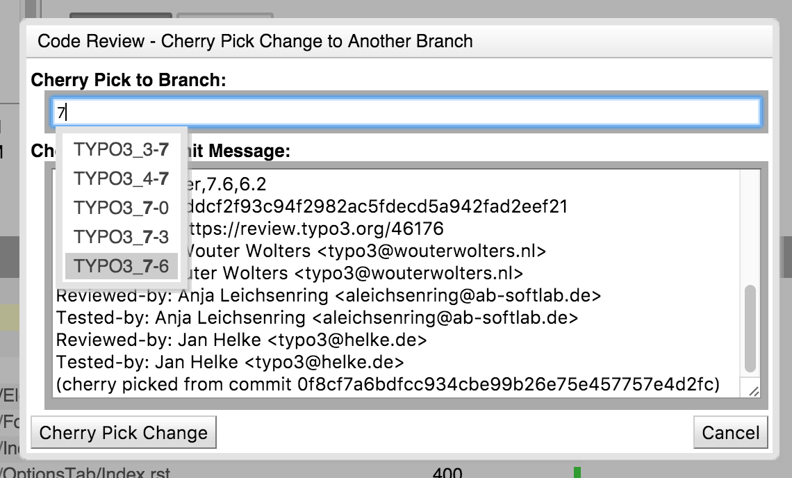
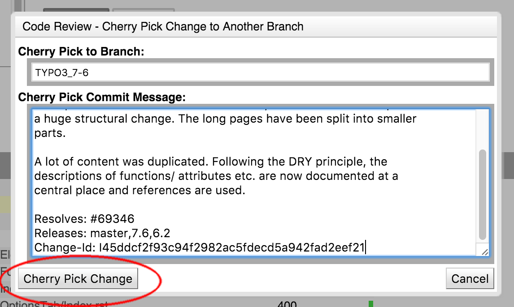

.. include:: ../../Includes.txt

.. _lifeOfAPatch:

====================
Lifecycle of a patch
====================

The code contribution workflow is based on so called "Change Requests (RFC)".
Each RFC fixes one or more issues on Forge. An RFC can be updated multiple times, adding a new "changeset" on top.

.. note::

   This tutorial assumes your environment is set up properly as described in
   :ref:`Contribution Walkthrough Environment Setup<setup>`

Reviewing a Change Request (RFC)
================================

Reviewing consists of two parts:

A **code-review** and **testing the change** (manual testing + unit tests + functional tests)

Code Review
-----------
A basic code review is possible by using the Gerrit web interface.
Simply navigate to the RFC and use the diff-tool ("side-by-side" or "unified").
You can add comments to the code lines.

Using the **Reply button**, you can post your comments and add a note.
Of course you should also vote for the change (Be graceful with -1 votes though.).
If you're able to improve the patch yourself, it is very much appreciated if you also submit an improved version.
(see below)

Testing a patch
---------------

For testing the actual patch you need to import the change into your local repository.
Gerrit helps a lot by providing the necessary command line to cherry-pick the change.
Use the **Download button** on the top right, and copy the command next to the "cherry-pick" label.

Make sure your local repository is clean and you don't have any additional patches applied.
(use the git reset command as shown below to cleanup)
Apply the change to your local repository by pasting the command from Gerrit on your command line.

Test the patch in your local TYPO3 installation and verify the reported bug is fixed and no other bugs
are introduced with the change.

Depending on the outcome of your tests, place your positive/negative vote in Gerrit, using the **Reply button**.

If you want to help the author and provide an improved patch, continue with the next section.

Otherwise throw the changes away, to bring your repository back to a clean state:

.. code-block:: bash

   git reset --hard origin/master

Improving a change and uploading a new Patch Set
================================================

To improve an existing Patch Set, make sure your local repository has the latest changes.

.. code-block:: bash

   git fetch
   git reset --hard origin/master

After that, cherry-pick the latest patch set from Gerrit as described above.

Edit the files to solve your concerns and test this new version carefully.

Update the change by **amending** the previous commit. This will overwrite the commit you fetched from Gerrit
with your changes:

.. code-block:: bash

   git commit --amend -a

.. warning::

   Make sure to not change or remove the Change-Id: line!

You can amend as often as you want. Once you are satisfied, push your improved Patch Set to Gerrit:

.. code-block:: bash

   git push origin HEAD:refs/publish/<release-branch>

where <release-branch> has to be replaced with the target branch as shown in Gerrit.
If you're currently working on the master-branch this must be ``refs/publish/master`` as well.

Starting a new Change Request (RFC)
===================================

Make sure you have a clean local repository. (see above)

Create or pick an issue on the Bug tracker. We will pretend to work on issue number #12345 here.

Make changes to the source code.

Review your changes by showing the differences to the previous state:

.. code-block:: bash

   git diff

Rework the changes if needed.

If you're creating a new Feature or your patch breaks existing functionality, you're required to add a documentation file. Details on that can be found in this HowTo.

Commit the changes to your local repository:

.. code-block:: bash

   git commit -a

Use an informative commit message for your change, following the rules described in the CommitMessage Format (Git)
page. This step is important, as your commit message will be used in the Change Log and should also help the
reviewers to understand your intention.

You may re-adjust your commit by using the ``git commit --amend`` command.

Before you submit your Patch Set for review, check what you are going to push:

.. code-block:: bash

   git log origin/<release-branch>..HEAD

You must only see one commit (for the basic workflow described in this guide).

To submit the patch to Gerrit, issue the following command:

.. code-block:: bash

   git push origin HEAD:refs/publish/<release-branch>

where <release-branch> has to match the branch you're currently working on. Please note, that all patches need to
be targeted at least for master. If other branches are involved, list them in your commit message in the releases
line, but still your push goes to master. Don't push for all intended branches, push to master only. Your patch will
most probably be discussed and changed, until it is ready to be merged. After this, backports to the other targeted
branches are done, the responsibility here takes the person who merged the master patch.

Long story short: **push to master**. The rest is being taken care of when time is right.

If Gerrit accepts your push, it responds with the following messages:

.. code-block:: bash

   remote: New Changes:
   remote:   https://review.typo3.org/<gerrit-id>
   remote:
   To ssh://<username>@review.typo3.org:29418/Packages/TYPO3.CMS.git
    * [new branch]      HEAD -> refs/publish/<release-branch>

You can visit the link to https://review.typo3.org to follow the review process. Gerrit will notify you by email
as soon as your Change Request is reviewed.

If Gerrit refuses your push, please read the Troubleshooting Guide.

Finally clean up your local repository again.

Backporting a change to other branches
======================================

.. note::

   This is an informative section targeted towards Active Contributors only.

First wait until the review process was successfully passed for the most recent affected branch.

Use Gerrit for the cherry-pick
------------------------------

First try to use the Gerrit cherry-pick feature for automatic backporting.

.. image:: ../_assets/gerrit_cherrypick_1.png
   :width: 400px

In the following modal, you can easily select the branch, you want to cherry pick to, by just typing partial information.

Remove from the commit message everything below the Change-ID because the information about former reviewers is not needed
for the cherry pick. Make sure that you **don't alter the Change-ID** but remove every line (also empty ones) below it. After doing so hit the "Cherry Pick Change" button.

Manual backport
---------------

If the automatic backporting fails, you need to manually cherry-pick the patch to the target branch. (e.g. cherry-pick the
master patch onto your local (up to date) TYPO3_6-2 branch) You will most likely need to adjust the code for the older branch.

Edit the commit message to comply to the guidelines again. (e.g. remove the Reviewed-* and Tested-* lines added by Gerrit)
**Keep the Change-Id though!**

Push the review back to Gerrit.

On Gerrit the original patch will show the cherry-pick as a related patch.

.. _lifeOfAPatch-Reverting-Patches:

Reverting patches
=================

.. note::

   This is an informative section targeted towards Active Contributors only.

It is important to have traceable code. This means that any person inspecting the bug tracker, Gerrit changes or the
commit log shall be able to trace if a patch has been reverted. Therefore we must add this information to all affected
places.

If there's the need to revert a patch, please stick to the following rules:

#. Create a ticket on Forge for the revert, if there's not yet a bug report. (Maybe re-use the original ticket,
   if you re-push the patch again with the original ticket number.)

#. Visit the original ticket in Forge and

   #. link it to the revert ticket

   #. add a comment to the ticket with information that it is reverted

   #. set the Status from Resolved to Accepted

#. Use the Revert button in Gerrit

#. Modify the commit message of the newly created patch to contain

   #. the commit hash as generated by Gerrit

   #. a description why the revert is needed

   #. a Releases-line that contains all releases where the original patch was merged (check if the backports where
      really merged)

   #. a Resolves-line for the revert ticket as created above (you can skip this if you re-used the original ticket)

   #. a Reverts-line for the ticket of the original patch
