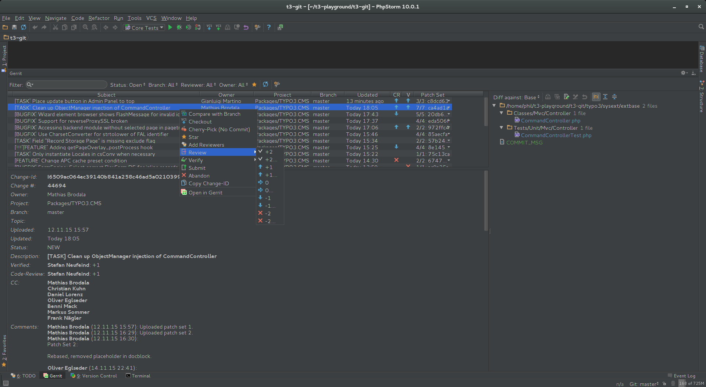

.. include:: ../Includes.txt

.. _phpstorm-gerritplugin:

=======================
PhpStorm: Gerrit Plugin
=======================

There is a very handy plugin for PHPStorm which will get Gerrit_ into the IDE PHPStorm.

In order to make it work just install the plugin by opening up PHPStorms preferences and navigate to ``Plugins``.

Click ``Browse Repositories`` at the bottom and enter ``Gerrit`` in the search box.

.. image:: _assets/phpstorm-gerrit-install.png

After restarting PHPStorm you need to go back to PHPStorms preferences and navigate to ``Settings > Version Control > Gerrit``.

.. image:: _assets/phpstorm-gerrit-settings.png

Enter ``https://review.typo3.org`` as the URL and add your login credentials you use on TYPO3.org.

The Gerrit module appears at the bottom next to version control.

For further reference, refer to the screenshot above. The UI and options follow the Gerrit web interface and integrate into
PHPStorms native look, feel and workflow.

You can learn more about the plugin here: https://github.com/uwolfer/gerrit-intellij-plugin
