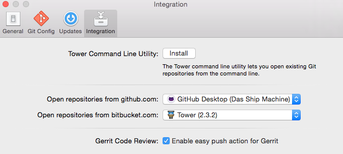

.. include:: ../../Includes.txt

.. _gittower-osx:

======================
Working with Git Tower
======================

.. sidebar:: Git Tower

   .. image:: _assets/tower_app_icon.png
      :width: 200px

Git Tower is a Git GUI for OSX.

Tower provides extended support for Gerrit_, which comes in handy because we work with Gerrit_ in the TYPO3 project.

Although it is a paid product, we think the cost is absolutely worth it.

You can learn more about Git Tower on their website http://www.git-tower.com/.

Enabling Extended Gerrit Support in Tower
=========================================

In Tower's preferences window, activate the ``Gerrit Code Review`` option.
This will enable the following adaptions in Tower's UI.

Restart Tower after you enabled the setting.

Pushing to Gerrit
=================

With the Gerrit option enabled in Tower's preferences, performing "Push" operations to Gerrit becomes easier:

Custom Menu Options
   When right-clicking a local branch in the sidebar, a new Push <branch> to Gerrit… menu option is available. If you hold
   down the ⌥ key, the item becomes a "quick" action that will be performed without a confirmation dialog.

Custom Toolbar Button
   You can add a custom Gerrit Push button to the toolbar. To do this, choose ``Customize Toolbar`` from the "View" main
   menu and drag the corresponding button onto the toolbar.

   .. image:: _assets/tower_gerrit_pushbutton.png
      :width: 400px

You'll find that the following dialog is optimized for pushing to Gerrit. It will automatically format the Push Refspec
according to Gerrit's requirements - so you can simply enter the name of the code review branch you want to push to.

