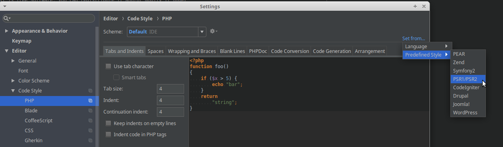

.. include:: ../../Includes.txt

.. _phpstorm-setup:

===================
Setting up PhpStorm
===================

Here are some hints and examples, what you can do to setup PhpStorm.

Conventions on this page
========================

If you need to select something from the menu in PhpStorm, menu items
are displayed like this: `File: Settings: ....`

General setup
=============

`File: Settings: Languages & Frameworks: PHP`

* `PHP Language Level`: choose appropriate version
* `CLI Interpreter`: choose appropriate version

.. image:: _assets/phpstorm-settings-language+frameworks-php.png
   :align: center
   :alt: Setup PhpStorm PHP settings

.. _phpstorm-setup-cgl:

Coding Guidelines
=================

Make sure your IDE is setup properly to comply with the
:ref:`Coding Guidelines for TYPO3 (CGL) <t3coreapi:cgl>`. For example,
(following PSR-2) space characters (not tabs) are used to indent source
code. See
:ref:`Whitespace and indentation <t3coreapi:cgl-general-requirements-for-php-files>`
for more information.

.. hint::
   Please also note that there is an .editorconfig file in the TYPO3 core repository.
   See http://EditorConfig.org for more information.

PHP files
---------

`File: Settings: Editor: Code Style : PHP : Set From : Predefined Style`

Choose PSR-1 / PSR-2

In order to test this, use `Code: Reformat Code` to reformat a PHP file

More information
-----------------

You can find more information on the :ref:`Coding Guidelines section in the Appendix
<appendix-cgl>`.

.. _phpstorm-setup-plugins:

Optional Plugins
================

Here are some Plugins, you might use when developing TYPO3.

.. hint::
   None of these Plugins are mandatory, check out what might be useful for yourself!

Install Plugins: `File: Settings: Plugins`

* `DynamicReturnTypePlugin
  <https://plugins.jetbrains.com/plugin/7251-dynamicreturntypeplugin>`__ :
  With this Plugin, return types for some functions can be configured
  dynamically. For example, if you use `GeneralUtility::makeInstance`,
  the expected return type is determined from the first parameter
  passed to the function. The configuration file for this plugin is
  `dynamicReturnTypeMeta.json
  <https://github.com/TYPO3/TYPO3.CMS/blob/master/dynamicReturnTypeMeta.json>`__
* `Php Inspections (EA Extended)
  <https://plugins.jetbrains.com/plugin/7622-php-inspections-ea-extended->`__ :
  Static Code Analysis tool for PHP
* `TYPO3 CMS Plugin
  <https://plugins.jetbrains.com/plugin/9496-typo3-cms-plugin>`__
* `TYPO3 XLIFF Utility
  <https://plugins.jetbrains.com/plugin/8098-typo3-xliff-utility>`__
* `TypoScript plugin
  <https://plugins.jetbrains.com/plugin/7463-typoscript-plugin>`__
* :ref:`phpstorm-gerritplugin`

.. _phpstorm-setup-testing:

Setting up  PhpStorm for the Testing Framework
==============================================

First setup the Testing Framework. Replace <YOUR_WEBROOT> with your path
to the web directory. You must use absolute
paths for this.

`File: Settings: Languages & Frameworks: PHP: Test Frameworks`:

* Use composer autoloader
* `Path to script`: <YOUR_WEBROOT>/vendor/autoload.php
* Test runner: Defaut configuration file:
  <YOUR_WEBROOT>/vendor/typo3/testing-framework/Resources/Core/Build/UnitTests.xml
* Test Runner: Default bootstrap file:
  <YOUR_WEBROOT>/vendor/typo3/testing-framework/Resource/Core/Build/UnitTestsBootstrap.php

.. image:: _assets/phpstorm-settings-testing-framework.png
   :align: center
   :alt: Setup Testing Framework

If this is setup correctly, it will be possible to run your unit tests
from within the IDE.

Other Resources
===============

* https://wiki.typo3.org/Development/PHPStorm_Settings
