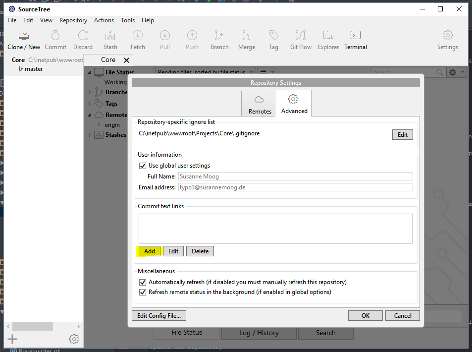
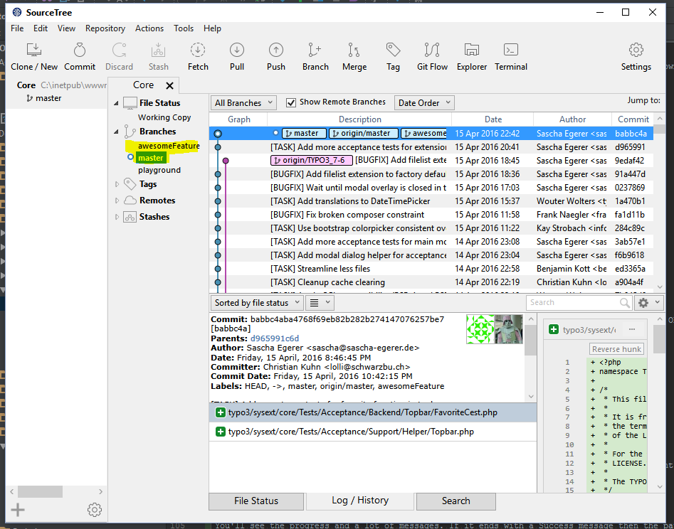

.. include:: ../../Includes.txt

.. _windows-clonewithsourcetree:

==================================
Cloning with SourceTree on Windows
==================================

SourceTree General Setup
========================

Prerequisites
-------------

In order to use SourceTree in Windows PuTTY should be installed and your SSH key loaded into pageant
(see :ref:`Create SSH key on Microsoft Windows <ssh-key-win>`).

Installation
------------

#. Download SourceTree at https://www.atlassian.com/software/sourcetree
#. Execute the installer

Basic Settings
--------------

First of all set the basic settings for your Git configuration by clicking on the settings button in SourceTree and
add your name, email and SSH Key. Make sure the option "SSH Client" is set to PuTTY/Plink.

.. image:: ../_assets/SourceTree/0_Win_SourceTree_Setup1.png

Clone
-----

To clone a new repository click on "Clone/New".

.. image:: ../_assets/SourceTree/1_Win_SourceTree_Clone.png

Enter the URL to your repository and the path to your local folder. For easier access to your repositories
leave the bookmark check box checked.

.. image:: ../_assets/SourceTree/2_Win_SourceTree_Clone_Repo.png

Click on Clone. Checking out the full TYPO3 Core repository might take some time, please be patient.

.. image:: ../_assets/SourceTree/2_Win_SourceTree_Clone_Repo_Success.png

Automatic links to Forge and Gerrit
-----------------------------------

The commit messages contain a reference to the corresponding Forge ticket and a Gerrit review link. To get direct
links from SourceTree choose the Core repository bookmark on the left and then click on the Settings button in the
top bar. Choose tab "Advanced" and click "Add" at the section for "Commit text links":

Choose "Replacement type:" "Other" and add

- Regex pattern: ``(\#)+((?:[0-9]*)?)``
- Link to URL: https://forge.typo3.org/issues/$2

.. image:: ../_assets/SourceTree/4_Win_SourceTree_Settings_Open_CommitTextLinks_Add_RegexForge.png

Repeat the steps for the Gerrit links and add

- Regex pattern: ``(https:\/\/review\.typo3\.org\/.*)``
- Link to URL: $1

.. image:: ../_assets/SourceTree/4_Win_SourceTree_Settings_Open_CommitTextLinks_Add_RegexGerrit.png

After adding these two settings your commit history now shows links:

.. image:: ../_assets/SourceTree/4_Win_SourceTree_Settings_Open_CommitTextLinks_Result.png

Reviewing and testing patches
=============================

Update the repository
---------------------

Before applying a patch you should update the repository to its latest state. Press the pull button from the main button
bar:

.. image:: ../_assets/SourceTree/5_Win_SourceTree_PullButton.png

Then click OK:

.. image:: ../_assets/SourceTree/5_Win_SourceTree_PullDialog.png

Cherry-picking
--------------

First visit the page of the patch in Gerrit. From the Download menu, choose the copy button after the 'Cherry Pick' line.

.. image:: ../_assets/gerrit_download_cherrypick.png

The next step has to be done via the command line. Open git bash by pressing "Terminal" and paste the copied line with
the 'Ins' button:

.. image:: ../_assets/git-bash-cherry-pick.png

The patch is now applied and you can start testing.

Creating patches
================

Commit hook
-----------

In each folder that contains a repository you need to execute the following command to install a Git hook which adds a unique
Change-Id to the commit message (and performs a few checks). Choose the repository from your bookmarks and click "Terminal"
to open a git bash for that repository. Copy the following command to the bash and execute it:

.. code-block:: bash

   curl -o .git/hooks/commit-msg "https://typo3.org/fileadmin/resources/git/commit-msg.txt" && chmod +x .git/hooks/commit-msg

.. note::

   You can read about the why and where of the pre-commit hook :ref:`here<commit-hook>`.

Setup for pushing to Gerrit
---------------------------

In the Git Bash window (click Terminal), enter the following commands to set that you push to Gerrit instead of the TYPO3 repository directly.

.. code-block:: bash

   git config url."ssh://<username>@review.typo3.org:29418".pushInsteadOf git://git.typo3.org
   git config remote.origin.push refs/heads/*:refs/for/*
   git config branch.autosetuprebase remote

Create a branch
---------------

It's easier to undo all the changes in a patch if you create a branch for it. Click on the branch button and enter
a name for your new branch, then click "Create Branch".

.. image:: ../_assets/SourceTree/6_Win_SourceTree_Branch_Create.png

Now start coding and commit your changes (By pressing the "Commit" button). Make sure your commit message is written
according to the >>>rules for the commit message<<< and click OK.

Your changes are now stored locally in a separate branch.

Send the patch to Gerrit
------------------------

Click the "Push" button to open the push dialog.

.. image:: ../_assets/SourceTree/7_Win_SourceTree_Push_RefsForMaster.png

Check the checkbox in front of your feature branch. As remote branch add "refs/for/master" - which will create a new patchset
for master. If you want to create patches for older branches use 'refs/for/<branchName>', for example 'refs/for/TYPO3_6-2'.
Be aware that you have to fix a bug in master first before it can go to older branches.

Now click ok. You should get a Gerrit link to your new change in the resulting output.

Cleaning up
-----------

To get back to master just click on it at the "Branches" section. If you want to delete your feature branch,
right click on it and choose "Delete".

