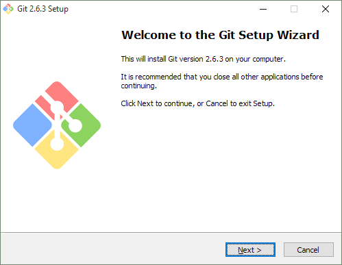
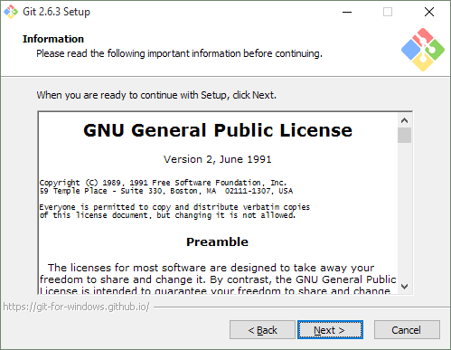
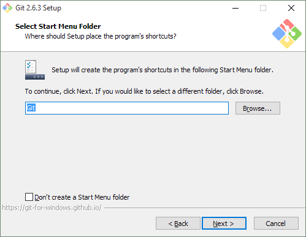
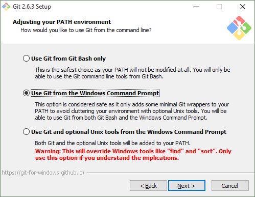
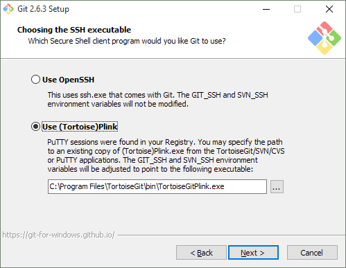
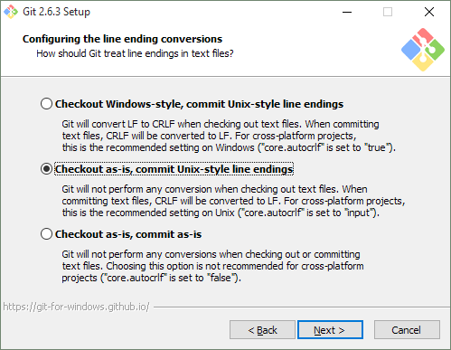
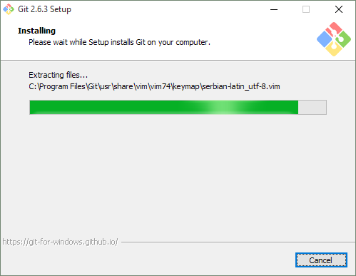
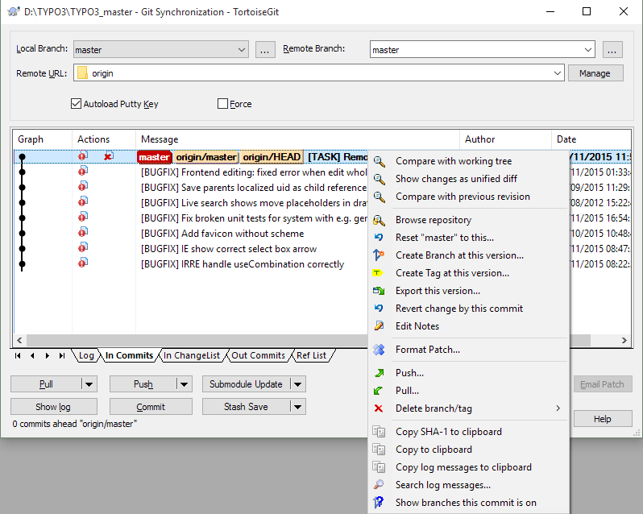
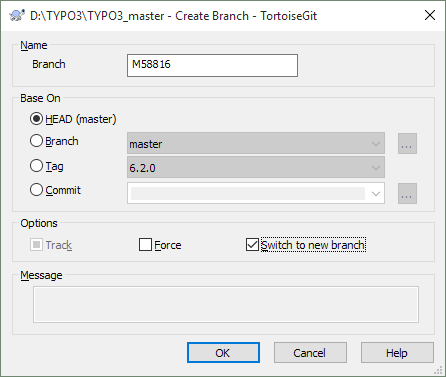
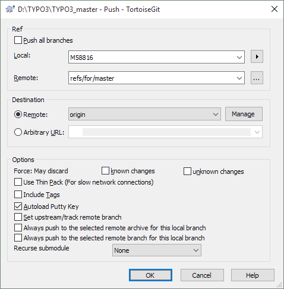

.. include:: ../../Includes.txt

.. _git-for-windows:

============================
Working with Git for Windows
============================

Installation
============

Download Git For Windows from  https://git-scm.com/.

Right-click the ``Git-x.y.z-nn-bit.exe`` file you downloaded and select the option "Run as administrator". Confirm that you
want to run the file.

Click "Next>" to start the installer

Click "Next>" to accept the GPL2 license.

.. image:: ../_assets/git-setup-3.png

Set or keep the proposed install directory and click "Next>"

.. image:: ../_assets/git-setup-4.png

Windows Explorer integration is very handy, especially the "Git Bash here" option.
Click "Next>" to use the selected options.

Chose whether you want to use a Start Menu folder and click "Next>"

The second or third option is mandatory for certain other programs. The second option is a good balance between a limited amount
of changes to your system and enough features. Select the one that suits you best and click "Next>"

If you already have PuTTY or other Tortoise... products it's best to select "Use (Tortoise)Plink". Click "Next>" after selecting.

Select the option "Checkout as-is, commit Unix-style line endings". This makes sure that files from the remote repository keep
their line endings, but if you happen to add a new file with Windows line endings it will be converted to Unix-style line endings
when you commit the file.

.. image:: ../_assets/git-setup-9.png

Select the terminal of your choice. Click "Next>" for the next step.

.. image:: ../_assets/git-setup-a.png

An experimental option; your decision. Click "Next>" after making your choice.

All git tools will be installed.

.. image:: ../_assets/git-setup-c.png

Done!

Configuration
=============

If you only use Git for TYPO3 then you can use the global settings. If you use it for several unrelated projects, then you can set
local settings; these are valid for a single repository. Think about the best settings for your situation. Perhaps the global
settings are best for your projects at work (perhaps a repository per project?) and then you can set the local settings for each
of the TYPO3 version and perhaps some extensions you maintain.

Initial clone
-------------

Right-click in the folder of your choice in the Windows Explorer and select from the context menu the option "Git clone...".

* URL: git://git.typo3.org/Packages/TYPO3.CMS.git

* "Load Putty key": select your .ppk file

Setting the SSH key in TortoiseGit
----------------------------------

Open the folder with the repository (here you'll find folders such as ``Build``, ``typo3`` and the hidden ``.git`` folder),
right-click to get the context menu and select "TortoiseGit > Settings".

You'll first get a notification about the way that system wide, global and local settings work.

.. image:: ../_assets/tortoise-setting.png

The username and email address have to be the same as you entered in Gerrit

.. image:: ../_assets/tortoise-remote.png

Select "Git > Remote", select 'origin' "Remote" server and browse with the [...] button to select the PuTTY private key in the
field "Putty Key".

In "General > Context Menu" and "General > Set Extend Menu Item" you can configure what appears in the context menu and what
appears in the TortoiseGit sub context menu.

Commit hook
-----------

In each folder that contains a repository you need to execute the following command to install a Git hook which adds a unique
Change-Id to the commit message (and performs a few checks).
Right-click the folder and select "Git Bash here".

.. code-block:: bash

   curl -o .git/hooks/commit-msg "https://typo3.org/fileadmin/resources/git/commit-msg.txt" && chmod +x .git/hooks/commit-msg

.. note::

   You can read about the why and where of the pre-commit hook :ref:`here<commit-hook>`.

Push to Gerrit
--------------

In the Git Bash window, enter the following commands to set that you push to Gerrit instead of the TYPO3 repository directly.

git config --global url."ssh://<username>@review.typo3.org:29418".pushInsteadOf git://git.typo3.org
git config --global branch.autosetuprebase remote

Links to bugtracker
-------------------

In "Hook Scripts > Issue Tracker Config" you can configure how TortoiseGit can turn issue numbers in the commit message into
links. In the Git log you can now click directly to the issue in forge.

.. image:: ../_assets/tortoise-bugtraq.png

* Enter in the field "bugtraq.url" ``https://forge.typo3.org/issues/%BUGID%``
* In the field "bugtraq.logregex" enter two lines:

   (Resolves|Fixes|Related):\s+#\d+
   (\d+)

Review walkthrough
==================

This will be a mix between command line options and TortoiseGit actions. If you have no problem remembering the various git
commands the command line walkthrough will tell you all the secrets.

Update the repository
---------------------

Although it's not hard to use the git pull command, the "Git sync" dialogue of TortoiseGit has a nice overview of the incoming
commits and all their changes. The context menu gives you all the options from the log viewer.

Create a branch
---------------

It's easier to undo all the changes in a patch if you create a branch for it.

Choose from the context menu "TortoiseGit > Create branch". Enter a name and enable the option "Switch to new branch". After
clicking the OK button it shows the progress of the operation.

Cherry-picking
--------------

Now we switch to the command line. First visit the page of the patch in Gerrit. From the Download menu, choose the copy button
after the 'Cherry Pick' line. Paste the line with the 'Ins' button in the Bash window.

.. image:: ../_assets/git-bash-cherry-pick.png

Now we can do the testing and register the votes in Gerrit.

Cleaning up
-----------

Because there is a separate branch for this patch the only thing that is needed is to checkout master. This can be done on the
command line ('git checkout master') or using TortoiseGit by using from the context menu "TortoiseGit > Switch/Checkout...".
Select the branch 'master' from the dropdown and click OK.

Starting a new patch
====================

  * First create a new branch (see the review walkthrough).
  * Make your changes in the code
  * From the context menu select "Git commit -> <your_branch_name>..."
  * Enter the commit message according to the >>>rules for the commit message<<< and click OK

Your changes are now stored locally in a separate branch.

Send the patch to Gerrit
========================

From the context menu select "TortoiseGit > Push".

In the field "Local" there is already the name of your branch
In the field "Remote" make sure there is the value 'refs/for/master' if you push for current master. If you push for older
branches the name could be 'refs/for/TYPO3_6-2' and so on.
"Destination > Remote" should be 'origin'.
Make sure the option "Autoload Putty Key" is enabled.
If all is correct, click the OK button.

You'll see the progress and a lot of messages. If it ends with a Success message then the patch is present in Gerrit. Otherwise
review the messages to see what went wrong.
