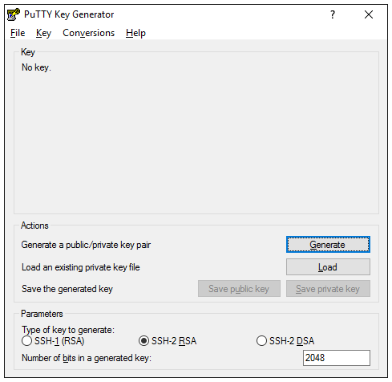
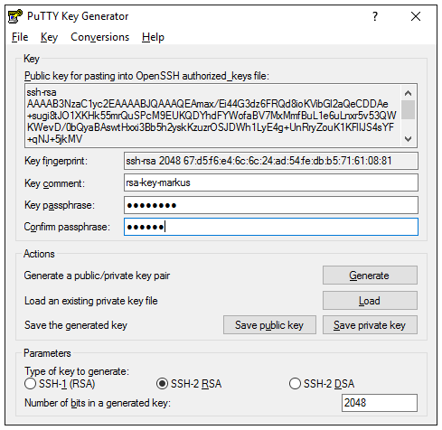

.. include:: ../../Includes.txt

.. _ssh-key-win:

====================================
Creating a SSH Public Key on Windows
====================================

In order to create a SSH key for windows you can follow these steps.

Generate your keys with Putty
=============================

#. download putty http://the.earth.li/~sgtatham/putty/latest/x86/putty-0.66-installer.exe

#. start "PUTTYgen" from the start menu

#. click the Generate (1) button and follow the screen instructions

4.) Fill the fields for comment (1) and add your name for instance
5.) Add a passphrase for your pivate key (2, 3)
6.) Save you private key in a protected place on the local filesystem (4)
7.) Copy the displayed public key and add it to your Gerrit account

.. note::

   Keep in mind that putty uses a proprietary format to store keys, which is incompatible with OpenSSH, when you use any
   of the save-buttons. If you need to store you private key in the OpenSSH format use the menu item Conversions->Export
   OpenSSH key.

Use pageant to load your pivate key on startup
==============================================

Putty provides a key agent named "pageant", which can be added to your autostart folder.
This allows you to enter your passphrase only once at startup and any tools using putty (e.g. git-for-windows,
tortoisegit, etc.) can automatically use your private key.

In order to achieve this, create a new shortcut in the following folder:
:file:`C:\Users\<username>\AppData\Roaming\Microsoft\Windows\Start Menu\Programs\Startup\`.

The target of the shortcut must be:

.. code-block:: shell

   %ProgramFiles(x86)%\PuTTY\pageant.exe "<full path to your saved private key.ppk>"

pageant will run as background task and will place a nice little icon into your tray icons.
