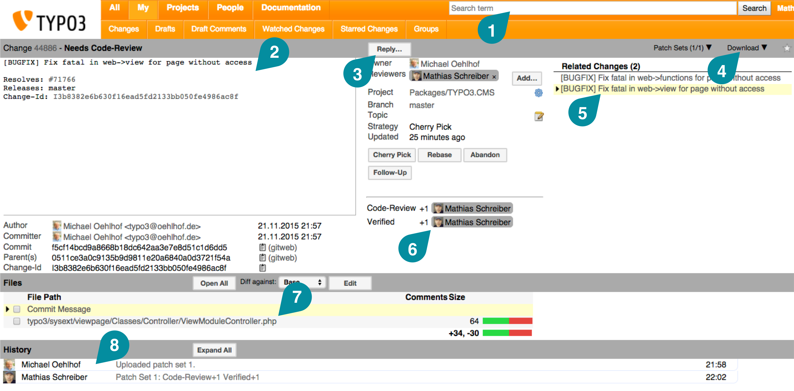
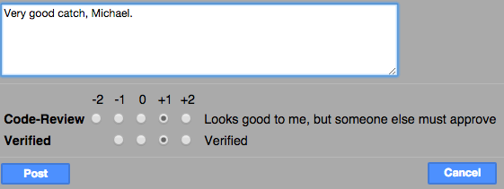
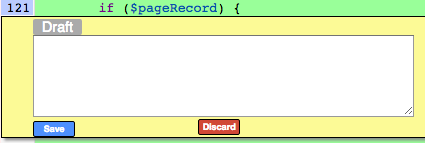
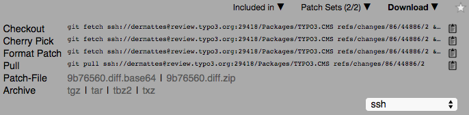

.. include:: ../Includes.txt

.. _Working-with-Gerrit:

===================
Working with Gerrit
===================

This chapter will explain the most important parts of the Gerrit_ UI to you.

.. _Gerrit-Overview-of-the-UI:

Overview of the UI
==================

This is a screenshot of an open review on Gerrit_. We will go through the parts of the UI next:

#. The **search box** lets you write complex search queries with little coding knowledge. For detailed information on how to
   use the search, refer to the official documentation on https://review.typo3.org/Documentation/user-search.html.

#. The **commit message** formatted like we explained in :ref:`"The commit message"<commitmessage>`.

#. The **Reply Button** which you will use to vote on code quality and testing as well as to send comments. We will be
   covering this button in more detail later.

#. The **Download Button**. You will be using this control to cherry pick a change in order to test it later.

#. Other changes **related** to this change. This can be either due to a similar topic or because the commit summary is
   related to the change we are currently reviewing.

#. The **current review status**. Here you can see who has voted (and how they voted) on a change. Note that if a
   change gets refined over time with new patch sets, your votes will be reset (simply because the review has changed).

#. All **changed files** in this current change. You can click every file to take a look at what exactly has changed. There
   is a select box on top of the file list that allows you to do a diff between patch sets to quickly see what has changed.

#. The **history** of this change. Here you can see comments, new patch sets, votes on a change etc.

.. _Gerrit-Commenting-and-voting:

Commenting and voting
=====================

In order to comment on a change you can click on the **Reply button** and enter your comment. Here, you
can also apply your votes.

.. sidebar:: Votes

   The +2 and -2 votes only available for core developers. See the section `Policy for votes`_. for more details.

Click on ``Post`` and your comments will be saved. At the same time all other contributors who either watched this change
or have already voted on this change will get notified. This is a good time to build a rule in your email client btw.

.. _Gerrit-Policy-for-votes:

Policy for votes
================

**Code Review:** Needs +1 of two reviewers, one of them being a core developer.

**Verified:** Needs +1 of two reviewers, one of them being a core developer.

A core developer can give a +2 right away on these two checks if another +1 vote already exists.

Authors should not vote for their own patches, unless the patch has been changed substantially by other developers.

As soon as the patch has reached the approved status by getting a +2 on **Code Review** and **Verified**, a core developer can decide to push the "Submit" button, finally pushing it to the main repository.

.. _Gerrit-No-brainers:

No brainers
-----------

A core developer can give a +2 and submit right away in case of "no-brainers" (what used to be called "FYI").
A core developer can give a +2 and wait a bit before submitting (used to be FYI24, FYI48, ...).

.. _Gerrit-Practical-considerations:

Practical considerations
------------------------

The active core developer who gave an early +1 should try and go back to transform the +1 into a +2 after a second review came in, if applicable.
Each newly pushed patch requires a complete new round of voting before it can be submitted. So everyone that reviewed once is invited to re-vote as soon as a new patch is pushed. Using Gerrit's Patch History feature allows to quickly see what has changed from the already reviewed patch to the new one. Consider these rules when comparing patches:

* If the patch was re-pushed due to the comments, check the diff between the versions of the patch.
* If the patch needed to be rebased onto current master, the changeset might contain the changes due to rebasing. So better check the diff between base and most recent version in this case.

.. _Gerrit-Commenting-files:

Commenting files
================

If you spotted a mistake in any file, you should provide the author with a useful clue where the mistake has been made.
One way would be to simply note the filename and line number in the central comment box. But this would be cumbersome and
annoying to handle (imagine a change with 150 files being modified). But Gerrit_ has a solution for that.

.. sidebar:: Diff View

   You can either use a **side-by-side** diff view or a classic **inline** diff depending on your settings in Gerrit_.

If you click on a file in the **changed files** section, you will see a diff of this file against the current codebase.

Simply point to the place you want to add a comment and hit the :kbd:`C` key on your keyboard. Leave your comment in the comment
box and hit ``Save``. Keep in mind that all comments will not be sent to the reviewers immediately - you will still need
to use the **Reply Button** to send them all (ideally with a vote indicating how severe your finding were).

.. _Gerrit-Reset-to-a-clean-state:

Reset to a clean state
=======================

Before you cherry-pick the change, you should reset your current master to a clean state

You can use the following commands in the root directory of your cloned TYPO3 repository:

.. code-block:: bash

   git reset --hard origin/master
   git pull

.. _Gerrit-Testing-a-change:

Testing a change
================

.. sidebar:: TYPO3 Review Box

   If you do not want to code anything but like to review changes, there is a dedicated, easy to use Review Box based
   on Vagrant available at https://github.com/Tuurlijk/TYPO3.Homestead.

If you want to test the changed code on your local machine you can use a technique called **cherry-picking** with Git.
In order to get the right command Gerrit_ offers a handy feature available under the **Download Button** in the top right
corner of the Gerrit_ UI.

If you click on the "copy" command next to **Cherry Pick**, Gerrit_ will automatically copy the entire line into your
clipboard. (If this does not work for some reason, click on the command under "Cherry Pick". Gerrit_ will automatically
mark the entire line and you can copy it into your clipboard via ``Ctrl-C`` or ``Cmd-C``, depending on your operating
system.)

Then paste the command in your Terminal application of choice und run it. Make sure, you are using the current master.

For example, run the following:

.. highlight:: bash

::

   git reset --hard origin/master
   git pull
   # use the correct cherry-pick commmand here
   git fetch https://review.typo3.org/Packages/TYPO3.CMS refs/changes/<no>/<revid>/<change> && git cherry-pick FETCH_HEAD

.. important::

   Make sure to always get the latest patch set of the current review. You can check this by looking at the **Patch Sets**
   menu left of the **Download Button**. The left and right numbers should always be the same, so you know you picked the
   latest patch set. You can also klick on **Go to latest patch set**.

.. git-reset-to-a-clean-state:

After this Reset to a clean state again::

   git reset --hard origin/master
   git pull
