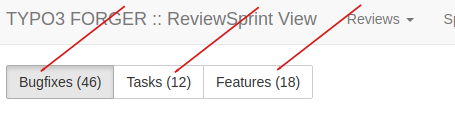

.. include:: ../Includes.txt

=======================
Find a review on Gerrit
=======================

.. _Find-a-review:

For finding an existing review (patch), there are several possibilities. Use whatever
is most convenient for you or what fits your needs.

Forger
======

In any case, you can use `Forger <https://forger.typo3.org>`__ to
search for the review.

Examples:

* select `Reviews : All <https://forger.typo3.com/gerrit/status>`__
  to view and filter for reviews
* `Sprints Reviews <https://forger.typo3.com/sprint/reviews?&boardId=bugfix>`__
  to see a board
  of all open patches by type (Bugs, Tasks, Features)

* `Sprints : Sprints Boards : Next patch level <https://forger.typo3.com/sprint?&boardId=next-patchlevel>`__

Email notification
==================

If you are in any way involved in the review (e.g. you are author,
reviewer or you made changes), you will get a notification about
it to your email adress. The notification contains a link.

Gerrit: Your Changes
====================

For your own patches, go to `Gerrit <https://review.typo3.org>`__
and select Your: Changes.

.. image:: _assets/gerrit-your-patches.png
   :class: with-shadow

Gerrit: Open Changes
====================

Select `Changes : Open <https://review.typo3.org/q/status:open>`__ to
get the latest changes or changes with recent modifications.

Gerrit: Search
==============

Or use the search box on `Gerrit <https://review.typo3.org>`__

Forge
=====

Once a patch has been pushed for an issue, the corresponding issue
on `Forge <https://forge.typo3.org>`__ will contain comments with the
topic "Updated by Gerrit Code Review ..." and a link to the review on Gerrit.

