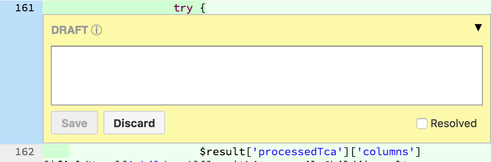
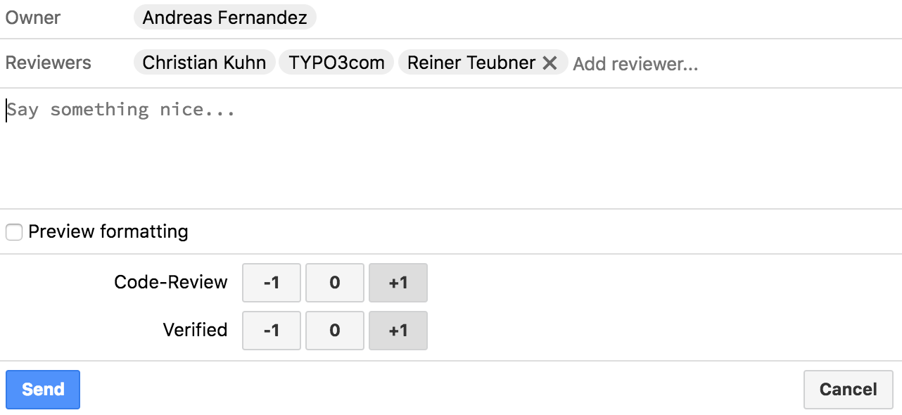

.. include:: ../Includes.txt

==============
Review a patch
==============

Reviewing consists of two parts:

A **code-review** (with optional comments) and **testing the change**. You can do both or just one or the other.

.. _lifeOfAPatch-review:

Code Review
===========

A basic code review is possible by using the Gerrit web interface.
Simply navigate to the patch and use the diff-tool ("side-by-side" or "unified").

You can add comments to the code lines. More information on this can
be found in the section :ref:`Gerrit-Commenting-files`.

Using the **Reply button**, you can post your comments and add a note.
Of course you should also vote for the change (Be graceful with -1 votes though.).
More information on voting in general can be found in the section
:ref:`gerrit-voting`.

If you're able to improve the patch yourself, it is very much appreciated
if you also submit an improved version (see :ref:`lifeOfAPatch-improve-patch`
for more information on this).

.. _lifeOfAPatch-test:
.. _Gerrit-Testing-a-change:

Test a patch
============

For testing the patch you need to import the change into your local repository.

Look at :ref:`cherry-pick-a-patch` for information on how to do this.

Test the patch in your local TYPO3 installation and verify the reported bug
is fixed and no other bugs are introduced with the change.

Depending on the outcome of your tests, place your positive/negative vote
in Gerrit, using the **Reply button**.

If you want to help the author and provide an improved patch, continue with the section
:ref:`lifeOfAPatch-improve-patch`.

Otherwise throw the changes away, to bring your repository back to a clean state:

.. code-block:: bash

   git reset --hard origin/master

.. _Gerrit-Commenting-files:

Comment files
=============

.. This section was moved from Gerrit/Index.rst

If you spotted a mistake in any file, you should provide the author with a useful clue where the mistake has been made.
One way would be to simply note the filename and line number in the central comment box. But this would be cumbersome and
annoying to handle (imagine a change with 150 files being modified). But Gerrit_ has a solution for that.

.. sidebar:: Diff View

   You can either use a **side-by-side** diff view or a classic **inline** diff depending on your settings in Gerrit_.

If you click on a file in the **changed files** section, you will see a diff of this file against the current codebase.

Simply point to the place you want to add a comment and hit the :kbd:`C` key on your keyboard. Leave your comment in the comment
box and hit ``Save``. Keep in mind that all comments will not be sent to the reviewers immediately - you will still need
to use the **Reply Button** to send them all (ideally with a vote indicating how severe your finding were).

.. _gerrit-voting:

Vote
====

In order to comment or vote on a change you can click on the **Reply button** and enter your comment. Here, you
can also apply your votes.

* +1 : you approve of the patch
* -1 : you do not approve, in this case give some reason as a comment

.. sidebar:: Votes

   The +2 and -2 votes only available for core developers. See the section `Policy for votes`_. for more details.

Click on ``Post`` and your comments will be saved. At the same time all other contributors who either watched this change
or have already voted on this change will get notified.

.. _Gerrit-Policy-for-votes:

Policy for votes
----------------

.. This section was copied from Gerrit/Index.rst

**Code Review:** Needs +1 of two reviewers, one of them being a core developer.

**Verified:** Needs +1 of two reviewers, one of them being a core developer.

A core developer can give a +2 right away on these two checks if another +1 vote already exists.

Votes from the Bamboo build server (user *TYPO3com*) do not count. This means
that a patch which is fully reviewed usually has at least 3 **Verified** +1
votes, two from humans and one from Bamboo.

**Authors should not vote for their own patches**, unless the patch has been changed
substantially by other developers.

As soon as the patch has reached the approved status by getting a +2 on
**Code Review** and **Verified**, a core developer can decide to push the
"Submit" button, finally pushing it to the main repository.

.. _Gerrit-No-brainers:
.. _Gerrit-Low-brainers:

Low brainers
-----------

A core developer can give a +2 and submit right away in case of "low-brainers" (what used to be called "FYI").
A core developer can give a +2 and wait a bit before submitting (used to be FYI24, FYI48, ...).

.. _Gerrit-Practical-considerations:

Practical considerations
------------------------

The active core developer who gave an early +1 should try and go back to transform the +1 into a +2
after a second review came in, if applicable.

Each newly pushed patch requires a complete new round of voting before it can
be submitted. So everyone that reviewed once is invited to re-vote as soon as
a new patch is pushed. Using Gerrit's Patch History feature allows to quickly
see what has changed from the already reviewed patch to the new one.

Consider these rules when comparing patches:

* If the patch was re-pushed due to the comments, check the diff between the
  versions of the patch.
* If the patch needed to be rebased onto current master, the changeset might
  contain the changes due to rebasing. So better check the diff between base
  and most recent version in this case.
