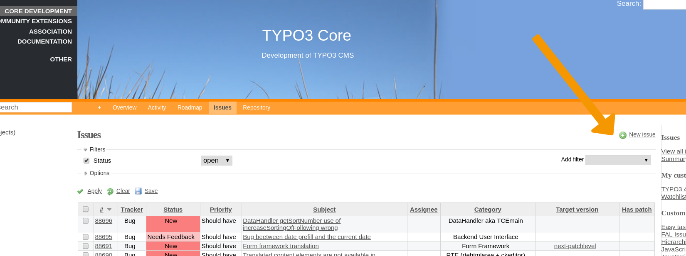
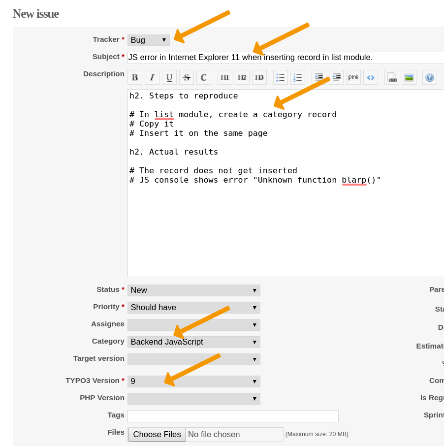

.. include:: ../Includes.txt

.. _forge-index:
.. _bugreporting-index:

===============
Report an Issue
===============

.. _forge-introduction:

Introduction to Forge
=====================

The issue tracker Forge is currently based on Redmine. It is used to
report and handle open issues (including bugs and feature requests).
First, get yourself an account, see
:ref:`TYPO3-Guide-ContributionWorkflow-Account`.

When you want to report a bug or suggest a new feature, go to the
`"Issues" section for the TYPO3 Core
<https://forge.typo3.org/projects/typo3cms-core/issues>`__.

Searching for Existing Issues
=============================

Before you go ahead and report a bug, it is recommended that you check
`Forger <https://forger.typo3.com>`__ to see if the same issue or
something similar has already been reported.

`Forger's <https://forger.typo3.com>`__ search functionality makes it
easy to find existing issues. Filters are located on the the left hand
side of the navigation menu. You can use this feature to help refine searches.

Identify the Issue
==================

Before you report a bug or suggest a new feature, make sure that
the issue you report will be helpful
by following these guidelines:

Remove side effects
   Work on a TYPO3 instance which is as clean as possible so you can
   rule out extensions messing with the TYPO3 core. If you need to set
   up an extension to illustrate the problem, make sure it is as free
   of side effects as possible.

Narrow down the problem
   Try different browsers, this will help the team (and you) a lot to
   provide a proper description of the problem.

Be up to date
   First of all you should make sure that the bug does exist on the latest TYPO3
   version; we always recommend you to upgrade your TYPO3 environment to the latest
   release of the LTS version you use.
   See https://get.typo3.org/ to get the latest version of your LTS.

   Or even better: use the latest version from git.

Talk to the core team
   When in doubt, don't hesitate to talk to us on `Slack <https://typo3.slack.com>`__
   in the **#typo3-cms-coredev**
   channel. (Remember to `register <https://forger.typo3.com/slack>`__
   first.)

.. _create-an-issue:

Create an issue
===============

:ref:`Get your typo3.org account <TYPO3Account>`, head over to Forge_ and log in (if you aren't already). 
You can find the TYPO3 core issue tracker here: https://forge.typo3.org/projects/typo3cms-core/issues.

.. tip::

   If you do not see the "New issue" link:

   #. make sure that you are logged in
   #. click on "CORE DEVELOPMENT" in the top left. Alternatively,
      you can click on the "Issues" link (in the orange bar at the top)

If you click "New issue" you will see a form with a couple of fields
that are important. Let's go over these really quick.

Tracker
-------

The tracker is just Redmines term for the type of issue. The trackers you will
be using the most are **Feature** and **Bug**.

The others are mostly for internal organization (like **Stories** and **Epics**)
and things which aren't really a feature or a bug... they are just **Tasks**
somebody needs to take care of.

Subject
-------

Pick a meaningful subject. Something like "Error in list module" is very generic
and doesn't help describing the problem. Just imagine how you would like to get
a report for yourself :)

.. tip::

   Remember, the subject is also helpful for people searching for already
   existing issues. Be as clear and precise as possible!

Bad example:
   Bug

Good example:
   JS error in Internet Explorer when inserting record in list module.

Description
-----------

For bugs, provide steps how to reproduce the problem. See :ref:`best-practices-bug-report`
for some extra hints on what should go in the description. 

Be sure to add images, code snippets and or stacktraces if they help to refine
the problem description. See :ref:`create-issue-files` for hints on adding files. 

Always keep in mind these points when writing your issue report:

Be detailed in describing your problem
   The more detail you add, the higher are the chances that we understand your
   problem. 
Be concise and clear
   No one will judge you for your literary skills. We need to understand quickly
   where the problem lies.
Format your issue
   Formatting your report helps readability. For longer text, use headers (h1, h2)
   to structure it. Use highlighted code (<>) for code snippets. Don't use very long
   sentences, instead use bullet points. See the section
   :ref:`formatting-in-redmine` for more information on formatting your text.
Be polite.
   Always.

Category
--------

Choose a category that fits your issue.

TYPO3 version 
-------------

(for bugs only)

Choose the TYPO3 version, where the error occurs.

PHP Version 
-----------

(for bugs only)

Choose the PHP version, where the error occurs. If in doubt, leave this blank.
Usually, it is enough to supply the TYPO3 version. 

.. _create-issue-files:

(optional) Files
----------------

You can additionally uploads files if they help to understand and reproduce the 
problem. 

Some hints for files:

* Do not copy-paste huge **stack dumps** into the description. Cut out the relevant parts
  for the description and add the complete stack dump as extra file. 
* **Images** can be a huge help in understanding the problem. Do not insert complete 
  screen dumps but clip the image to the relevant parts. If it helps, add boxes or
  arrows to highlight important things in the image. Use 
  :ref:`Redmine formatting for inline images <redmine-images>`
* If a **video** is even better in understanding a bug, try to create a short (!) 
  video that clarifies your issue. For example, use an animated gif screen capture 
  tool to create an animated gif.

.. tip::

   Use the "Preview" function at the bottom of the page to check if your
   issue is formatted well.

.. _best-practices-bug-report:

Best practices for writing a good bug report
============================================

It is **not** necessary to add **all** available information to your bug report. 
It is important to provide **the specific information that is necessary** to be
able to **understand**, **reproduce** and **fix** the bug. 

Use your common sense and your experience to guide you: What would you need if you
wanted to find the bug in the code and fix it? What do you need if you want to 
reproduce it to debug it or test if the patch solves the problem? 

A good bug report should contain all or any of these elements:

#. Prerequisites:

   Here you can add:

      + A brief description of your environment. Depending on the nature of 
        the bug it *might* inclde your operating system
        (Windows, Linux, macOS, ...), the full version of TYPO3, the webserver
        used, the database used (mySql, SQLServer, ...) and its version.
        In any case, the full version of TYPO3 (e.g. 9.5.1) is very helpful. If
        your bug is reproducible on several versions (e.g. 10.1.0 and 9.5.1), 
        that is helpful as well.
      + A description of the TYPO3 setup that you are using or that is necessary
        to trigger the bug. Your issue came out using TYPO3 with multiple
        languages? Or when you have more than two frontend groups? You have to
        tell us, otherwise we could not be capable of reproducing your issue.

   We don't need a full description of your environment, or the full TypoScript
   configuration, but just the parts that are relevant to trigger the bug.

#. Steps to reproduce the problem

   This is a short easy-to-follow guide that allows us to understand how to
   trigger the bug following it. Using a numerated list of steps is just fine
   here; you can also add screenshots.

#. Actual results

   This is the heart of your problem: what happened after you followed the
   steps? Please add also here if your problem is repeteable or comes out
   randomly.

#. Expected results

   What you expected to happen instead.

#. Additional notes

   Additional information like special conditions or other details not reported
   on the previous points.

Please consider that these guidelines are very generic. Not always all these parts are
necessary, but having the necessary information could help a lot to reproduce and fix
the bug. 

.. tip::

   Use redmine formatting to structure your bug report and make it more readable, for
   example use headlines (h1, h2) to structure the parts, hightlighted code (<>) for
   code snippets, code for inline images (!image!). 

.. _formatting-in-redmine:

Hints for formatting in Redmine
===============================

Redmine offers quite a few text formatting options: use them to make
your report readable. Remember, good formatting makes reading the
bug report easier and increases the probability that people will be
able to reproduce the problem and help with fixing, testing and
merging patches. During the life cycle of a bug report and patch,
several people will be reading your report. High readability and
clarity makes things easier for everyone and saves time.

.. _redmine-images:

Images
------

If you attach **images** (which makes sense, because a screenshot says
more than 1000 words), consider displaying it inline in your description
using exclamation marks to wrap your filename in - this saves everybody
a click and makes it easier to understand which image goes where. Do not
use fullscreen screenshots, provide a screenshot of the relevant parts
of the problem.

**Example:**

::

   !filename.png!

.. tip::

   When more images are added on with comments on your original issue, all
   images are displayed in a list. This makes it very difficult to determine,
   which file belongs to the original issue description. This is another
   reason to consider using inline images.

**See:**

* `Redmine Info <https://www.redmine.org/projects/redmine/wiki/RedmineTextFormattingTextile#Inline-images>`__

Code formatting
---------------

Do **not** add screenshots of code, use the ``<pre><code>`` tags in
Redmine so we can search for the lines of code via Forger.

External Links
---------------

Format your links correctly for better readability. You can insert the
URL directly, but if the URL is long, it is better to provide a
descriptive anchor text.

**Syntax:**

::

   "Anchor text":url

**Example:**

::

   "Forger search example":https://forger.typo3.com/search?query=really+long+query+string+with+filters&filters%5Btypo3_version%5D%5B8%5D=true&filters%5Bcategory%5D%5BLink_Handling_%26_Routing%5D=true

**See:**

* `Redmine Info: External links <https://www.redmine.org/projects/redmine/wiki/RedmineTextFormattingTextile#External-links>`__

Additional Resources
====================

* `Redmine Info <https://www.redmine.org/projects/redmine/wiki/RedmineTextFormattingTextile>`__
* `Symfony : Tips for reporting a bug <https://symfony.com/doc/current/contributing/code/bugs.html>`__
