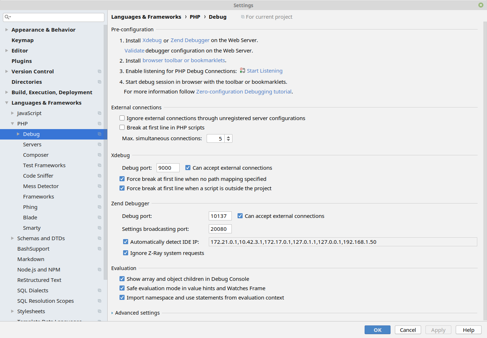
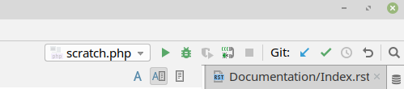
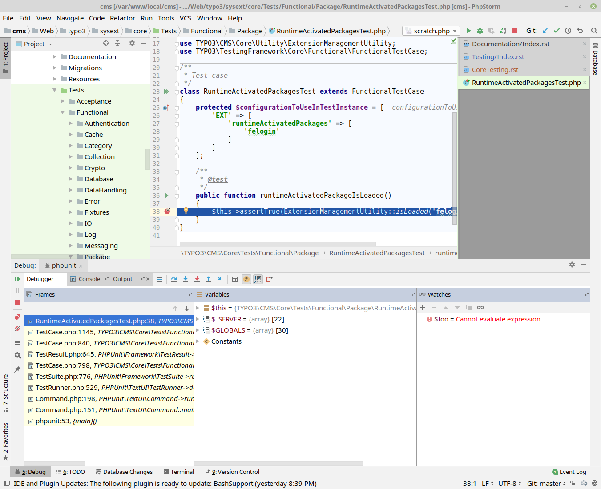

..  include:: /Includes.rst.txt
..  index:: pair: Testing; Core
..  _testing-core:

=====================
Core testing in depth
=====================

Introduction
============

This chapter is about executing TYPO3 Core tests locally and is intended to give
you a better understanding of testing within TYPO3's Core. A full Core git checkout comes with everything needed
to run tests in TYPO3.

Core development is most likely bound to the Core `main` branch - backporting patches to older
branches is usually handled by Core maintainers ("Mergers") and often doesn't affect other Core contributors.

The main entry point to perform testing and build-related actions is the helper
`Build/Scripts/runTests.sh <https://github.com/typo3/typo3/blob/main/Build/Scripts/runTests.sh>`_.
It works best when executed on a Linux based host but can be run under macOS and
Windows with some filesystem performance drawbacks on macOS. It utilizes Docker containers,
and more details can be found in :ref:`Using runTests.sh <t3contribute:runTests_sh>`.

Additionally, it *is* possible to execute tests on a local system without using Docker. Depending on
which test suite is executed, developers may need to configure their environments to run the
desired test. We however learned not too many people actually do that as it can become tricky. This
chapter does not talk about test execution outside of :file:`Build/Scripts/runTests.sh`.

..  _testing-core-dependencies:

System dependencies
===================

Many developers are familiar with `Docker <https://www.docker.com/>`_. As outlined in the
:ref:`history <testing-history>` chapter, test execution needs a well defined, isolated, stable and
reliable environment to run tests and also remove the need to manage niche dependencies on your local
environment for tests such as "execute functional test 'X' using PostgreSQL with xdebug".

Git and docker (or podman) are required. For standalone test execution, a local installation of
PHP is not required. You can even `composer install` a Core by calling `Build/Scripts/runTests.sh -s
composerInstall` in a container.

If you're using a Mac, install or update Docker to the most recent version using the packaging system of
your choice.

If you are using Ubuntu Linux 18.04 or higher, everything should be ok after
calling `sudo apt-get install git docker` once. For other Linux distributions
including older releases of Ubuntu, users should have a look at the Docker homepage to see how to update
to a recent version. It usually involves adding some other package repository and updating / installing using it.
Make sure your local user is a member of the `docker` group, else the script will fail with something like
`/var/run/docker.sock: connect: permission denied`.

Windows can rely on WSL to have a decent docker version, too.

Quick start
===========

From now on, it is assumed that git and docker (or podman) are available with the most up-to-date release
running on the host system. Executing the basic Core unit test suite boils down to:

..  code-block:: shell

    # Initial core clone
    git clone git@github.com:typo3/typo3.git && cd typo3
    # Install Composer dependencies
    Build/Scripts/runTests.sh -s composerInstall
    # Run unit tests
    Build/Scripts/runTests.sh

That's it. You just executed the entire unit test suite.
Now that we have examined the initial Core clone and a Composer install process, we will look at the
different ways we can utilize the :file:`runTests.sh` for other scenarios.

Overview
========

So what just happened? We cloned a Core, Composer installed dependencies and executed Core
unit tests. Let's have a look at some more details: :file:`runTests.sh` is a shell script that figures out
which test suite with which options a user wants to execute, does some error handling for broken
combinations and then uses local docker commands to run specific containers with specific options. Using
these containers, the actions are performed, and the containers are stopped after execution.

A Core developer doing this for the first time may notice that several container images
will be pulled before continuing. These are the dependent images needed to execute certain jobs. For instance,
a container providing the specific PHP-version may be fetched. The same containers are used for the
TYPO3 CI GitLab Pipeline, even utilizing the same `runTests.sh` script. What's impressive is that
you can locally run the same tests like a fully-fledged CI server..

The GitLab CI Pipeline is maintained through the Ansible infrastructure found on
`https://git.typo3.org/typo3/CI/testing-infrastructure/-/tree/main/ansible?ref_type=heads`__, and the Pipeline
itself is set up through `https://github.com/TYPO3/typo3/tree/main/Build/gitlab-ci/`__.

Compared to your local execution it's just that the combinations of tests
and splitting to different jobs which is slightly different, for instance GitLab CI paralelly performs multiple
tests with more complex version matrixes (PHP and Databases).

If a patch is pushed to GitLab and it complains about something being broken, it is possible to replay and fix the
failing suite locally, then push an updated patch and hopefully enable the tests to pass.

A runTests.sh run
=================

Let's pick a :file:`runTests.sh` example and have a closer look:

..  code-block:: shell

    lolli@apoc /var/www/local/cms/Web $ Build/Scripts/runTests.sh -s functional typo3/sysext/core/Tests/Functional/Authentication/
    PHPUnit 11.2.5 by Sebastian Bergmann and contributors.

    Runtime:       PHP 8.2.19
    Configuration: /Users/garvin/TYPO3/typo3-core-bugreproduce-base/typo3-core/Build/phpunit/FunctionalTests.xml

    ................................................................. 65 / 67 ( 97%)
    ..                                                                67 / 67 (100%)

    Time: 00:12.077, Memory: 103.00 MB

    OK (67 tests, 176 assertions)

    ###########################################################################
    Result of functional
    Container runtime: docker
    PHP: 8.2
    DBMS: sqlite
    SUCCESS
    ###########################################################################

    lolli@apoc /var/www/local/cms/Web $ echo $?
    0
    lolli@apoc /var/www/local/cms/Web $

The command asks :file:`runTests.sh` to execute the "functional" test suite `-s functional` and to not execute all
available tests but only those within `typo3/sysext/core/Tests/Functional/Authentication/`. The script first
starts the containers it needs: Redis, memcached (previously also MariaDB by default, which is now using
SQLite instead, due to less dependencies). All in one network. It then starts a PHP 8.2 container and calls
phpunit from there to execute the tests. phpunit executes only one test in this case, that one is green. The containers
and networks are then removed again. Note the exit code of :file:`runTests.sh` (`echo $?`) is identical to the exit
code of the phpunit call: If phpunit reports green, :file:`runTests.sh` returns 0, and if phpunit is red, the exit code
would be non zero.

..  _testing-core-examples:

Examples
========

First and foremost, the most important call is `-h` - the help output. The output below is cut, but
the script returns a useful overview of options. The help output is also returned if given options
are not valid:

..  code-block:: shell

    lolli@apoc /var/www/local/cms/Web $ Build/Scripts/runTests.sh -h
    TYPO3 Core test runner. Execute acceptance, unit, functional and other test suites in
    a container based test environment. Handles execution of single test files, sending
    xdebug information to a local IDE and more.
    ...

Some further examples: The most important tests suites are unit tests, functional tests and acceptance
tests, but there is more:

..  code-block:: shell

    # Execute the unit test suite with PHP 8.3
    Build/Scripts/runTests.sh -s unit -p 8.3

    # Execute some backend acceptance tests
    Build/Scripts/runTests.sh -s acceptance typo3/sysext/core/Tests/Acceptance/Backend/Topbar/

    # Execute some functional tests with PHP 8.2 and postgres DBMS
    Build/Scripts/runTests.sh -s functional -p 8.2 -d postgres typo3/sysext/core/Tests/Functional/Package/

    # Execute the cgl fixer
    Build/Scripts/runTests.sh -s cglGit

    # Verbose runTests.sh output. Shows main steps and Composer commands for debugging
    Build/Scripts/runTests.sh -v

As shown there are various combinations available. Just go ahead, read the help output and play around.
There are tons of further test suites to try.

Also note that you can use the `-b` option to switch between `docker` and `podman` container execution,
with `podman` being the default (when available).

One interesting detail should be mentioned: :file:`runTests.sh` uses several containers from
`https://github.com/orgs/TYPO3/packages`_ for PHP and JavaScript environments. Use the command
`Build/Scripts/runTests.sh -u` to fetch the latest versions of these containers.

..  index::
    Testing; Debugging
    Testing; Xdebug
    Debugging
    Xdebug

Debugging
=========

To speed up test execution, the PHP extension `xdebug` is not usually loaded.
However, to allow debugging tests and system under tests, it is possible to
activate xdebug and send debug output to a local IDE. We'll use PhpStorm for this example.

Let's verify our PhpStorm debug settings first. Go to :guilabel:`File > Settings > Languages & Frameworks > PHP
> Debug`. Make sure "Can accept external connections" is enabled, remember the port if it is not the
default port (9000) and also raise "Max. simultaneous connections" to two or three. Note remote debugging
may impose a security risk since everyone on the network can send debug streams to your host.

Accept changes and enable "Start listening for PHP connections". If you changed settings, turn them
off and on once to read new settings.

Now set a break point in an assignment. Note break points do not work "everywhere", for instance
not on empty lines and not on array assignments. The best way is to use a straight command. We'll use
a simple test file for now, add a breakpoint and then execute this test. If all goes well, PhpStorm
stops at this line and opens the debug window.

..  code-block:: shell

    Build/Scripts/runTests.sh -x -s functional -p 8.1 -d postgres typo3/sysext/core/Tests/Functional/Package/RuntimeActivatedPackagesTest.php

The important flag here is `-x`! This is available for unit and functional testing. It enables xdebug
in the PHP container and sends all debug information to port 9000 of the host system. If a local PhpStorm
is listening on a non-default port, a different port can be specified with `-y`.

If PhpStorm does *not* break as expected, some adjustments in this area may be required. First, make
sure "local" debugging works. Set a breakpoint in a local project and see if it works. If it works
locally, the container based debugging should also work. Next, make sure a proper break point has been set.
Additionally, it may be useful to activate "Break at first line in PHP scripts" in your PhpStorm settings. :file:`runTests.sh`
mounts the local path to the same location within the container, so path mapping is not needed. PhpStorm
also comes with a `guide <https://www.jetbrains.com/help/phpstorm/configuring-xdebug.html>`_ how to set up
debugging.

..  _building-assets:

Building
========

Luckily, `runTests.sh` also helps us to build JavaScript and CSS assets:

..  code-block:: shell

    Build/Scripts/runTests.sh -s build

Again, this utilizes all the needed containers for the proper NodeJS environment, so you have
zero local dependencies on properly building.

You can also run a watch task thanks to the full integration of npm command execution:

..  code-block:: shell

    Build/Scripts/runTests.sh -s npm -- run watch:build

