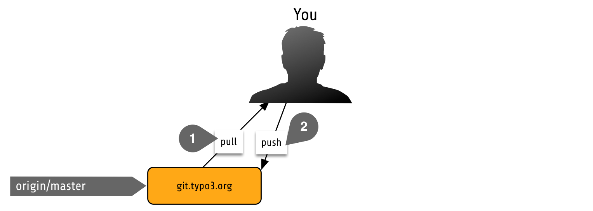
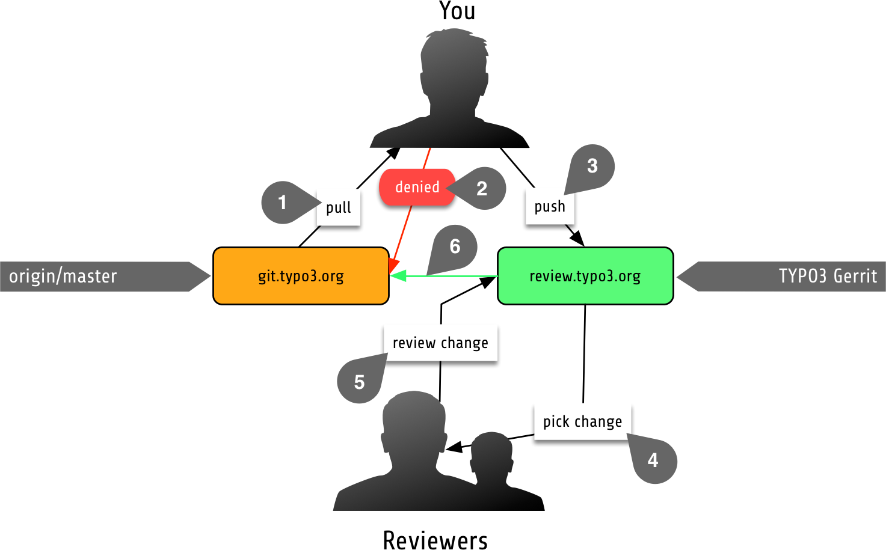

.. include:: ../Includes.txt

.. _workflow-explained:

============================
TYPO3 Contribution Explained
============================

Ok, so you want to overview first, that's fine. Actually, it's a brilliant idea to understand the concept first to help
you understand `why` we do things the way we do them. So let us walk you through that.

Regular Workflow
================

So this it what your usual coding workflow would look like.

#. You clone or pull from a central Git repository and change some lines of code
#. You push right back to that central repository

This workflow has some drawbacks though, because there is only a very low level of peer control over the code you are
pushing. Chances are relatively high that your change might break something elsewhere, does not comply to TYPO3s coding
guidelines, doesn't work on the respective PHP versions for the TYPO3 version you are working on.... in short: it's dangerous.

TYPO3 Contribution Workflow
===========================

As you can see, our workflow is a bit different, simply because we do not allow to push right back to our Git repository.
We use an 6-eye principle to ensure proper quality assurance and Gerrit_ helps us here - but let's go over the workflow step by step.

#. You clone or pull as usual and do changes to the codebase.
#. When trying to push back to the Git repository, you will not be allowed to do so. In fact, the only entity that may push
   back to our Git repository is Gerrit_ itself, so the same rules apply for everybody.
#. Instead, you push your changes to Gerrit_ and they will show up as a pending code review.
#. From here, any contributor can review the change.
#. Reviewing consists of two parts, the **Code Review** where a contributor checks if the code style is according to our
   coding guidelines or in general `makes sense` by reading and the **Verification** which means if the code does what it
   is supposed to do (like fixing an issue) and checks whether the unit tests run through.
#. If a review has enough positive votes, an **active contributor** (aka member of the core team) is able to merge that review
   into the existing codebase. The reason we need a member of the core team to finally merge the change is that we run a
   "You break it, you fix it" policy, so the core team member that merged a change immediately becomes responsible for that
   change in case the original author decides to no longer work on it. And he / she will be responsible for
   backporting it to older TYPO3 versions.

